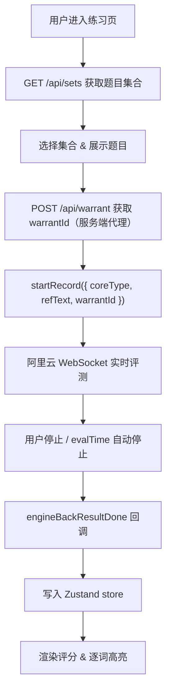

# 阿里云语音评测集成方案

## 1. 概述

本文档描述如何在 Learn EN 项目中集成阿里云智能科教内容生成平台 JS SDK，实现「选题 → 录音 → 阿里云评测 → 结果展示」完整闭环。

## 2. engine.js 放置位置

将阿里云提供的 `engine.js` 文件放置于：

```
public/sdk/engine.js
```

访问路径为 `/sdk/engine.js`，通过 Next.js `<Script src="/sdk/engine.js" />` 加载。下载地址请参考 [阿里云 JS SDK 开发文档](https://help.aliyun.com/zh/document_detail/2873513.html)。

## 3. 数据流



## 4. 环境变量

在 `.env.local` 中配置：

| 变量 | 说明 |
|------|------|
| `NEXT_PUBLIC_ALIYUN_APP_ID` | 应用 ID（AppKey），控制台获取，暴露到客户端 |
| `NEXT_PUBLIC_ALIYUN_USER_ID` | 用户标识，暴露到客户端 |
| `ALIYUN_APP_SECRET` | 应用密钥（AppSecret），控制台获取，**仅服务端**用于鉴权签名，切勿暴露 |

## 5. 新增/修改文件

| 文件 | 说明 |
|------|------|
| `public/sdk/engine.js` | 阿里云 SDK 文件（手动放置） |
| `app/api/warrant/route.ts` | 服务端鉴权代理 |
| `hooks/use-speech-eval.ts` | SDK 封装 Hook |
| `components/practice/RecordButton.tsx` | 录音按钮（idle / recording / loading 三态） |
| `components/practice/ScoreCard.tsx` | 评测结果展示 |
| `stores/practice-store.ts` | 补充 warrantId 缓存字段 |

## 6. 关键实现细节

### 6.1 鉴权接口 `/api/warrant`

- 服务端直接调用阿里云 `https://api.cloud.ssapi.cn/auth/authorize`
- 使用 `ALIYUN_APP_SECRET` 进行 MD5 签名（参数按键名升序拼接后加密）
- 从请求头 `x-forwarded-for` 或 `x-real-ip` 获取客户端 IP
- 响应：`{ warrantId }`，warrantId 有效期 7200 秒（2 小时），前端缓存在 Zustand store 中复用

### 6.2 use-speech-eval Hook

- 使用 `useRef` 持有 `EngineEvaluat` 实例
- 等待 `engineFirstInitDone` 回调后完成初始化
- `evalTime` 计算公式：`2000 + refText 单词数 × 600 + 1000` 毫秒
- 支持 `startEval(refText, coreType)`、`stopEval()`、`cancelEval()`

### 6.3 评测结果解析

- `result.result.overall` — 总分（0–100）
- `result.result.rank` — 等级描述（如「良好」）
- `result.result.details[i].char` — 单词文本
- `result.result.details[i].score` — 单词分数
- 颜色阈值：≥85 绿色，≥75 青色，≥55 灰色，<55 红色

### 6.4 题型与 coreType

| 题型 | coreType |
|------|----------|
| 英文单词 | en.word.score |
| 英文句子 | en.sent.score |
| 英文段落 | en.pred.score |

## 7. 注意事项

- 所有使用 `EngineEvaluat` 的组件必须标注 `"use client"`
- 本地开发使用 `localhost` 时，浏览器允许麦克风；生产环境需 HTTPS
- `NEXT_PUBLIC_` 前缀变量会暴露到客户端，`ALIYUN_APP_SECRET` 不加前缀，仅服务端使用
