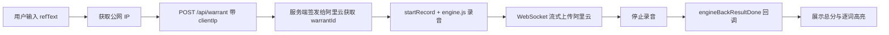

# 语音评测闭环成功流程

本文档记录 Learn EN 项目中「收集语音 → 阿里云评测 → 获得评分」闭环成功跑通后的完整流程与关键实现。

## 1. 闭环概览



## 2. 前置准备

### 2.1 engine.js 放置

将阿里云提供的 `engine.js` 放到：

```
public/sdk/engine.js
```

访问路径为 `/sdk/engine.js`。下载与文档见 [阿里云 JS SDK 开发文档](https://help.aliyun.com/zh/document_detail/2873513.html)。

### 2.2 环境变量

在 `.env.local` 中配置：

| 变量                         | 说明                                            |
| ---------------------------- | ----------------------------------------------- |
| `NEXT_PUBLIC_ALIYUN_APP_ID`  | 应用 ID（AppKey），控制台获取                   |
| `NEXT_PUBLIC_ALIYUN_USER_ID` | 用户标识                                        |
| `ALIYUN_APP_SECRET`          | 应用密钥（AppSecret），控制台获取，**仅服务端** |
| `ALIYUN_ACCESS_KEY_ID`       | 智能语音 TTS 用，主账号或 RAM 用户 AccessKey ID  |
| `ALIYUN_ACCESS_KEY_SECRET`   | 智能语音 TTS 用，主账号或 RAM 用户 AccessKey Secret |
| `ALIYUN_TTS_APPKEY`          | 智能语音 TTS 项目 AppKey，[智能语音控制台](https://nls-portal.console.aliyun.com/applist) 获取 |

### 2.3 阿里云控制台

在 [阿里云智能科教控制台](https://aicontent.console.aliyun.com/) 创建项目，获取 AppKey、AppSecret，并确认口语评测能力已开通。

## 3. 成功流程详解

### 3.1 快速测试页（无需 MongoDB）

访问 `/practice/test`，可独立验证闭环：

1. 输入评测文本（如 `hello world`、`there you go`）
2. 选择评测类型：单词 / 句子 / 段落
3. （可选）选择语速、发音人后点击「标准发音」收听参考朗读
4. 点击「开始录音」
5. 朗读后点击「停止录音」或等待 `evalTime` 自动停止
6. 查看总分（0–100）与逐词高亮结果

### 3.2 核心步骤

| 步骤            | 实现位置                                                  | 说明                                                                                      |
| --------------- | --------------------------------------------------------- | ----------------------------------------------------------------------------------------- |
| 1. 获取公网 IP  | `hooks/use-speech-eval.ts` 中 `getWarrantId`              | 请求 `api.ipify.org` 或 `ip.seeip.org` 获取客户端公网 IP                                  |
| 2. 请求 warrant | `POST /api/warrant`，body 为 `{ clientIp }`               | 前端将公网 IP 传给服务端                                                                  |
| 3. 服务端鉴权   | `app/api/warrant/route.ts`                                | 用 `clientIp` 作为 `user_client_ip` 调用阿里云 `auth/authorize`，MD5 签名后获取 warrantId |
| 4. 初始化引擎   | `use-speech-eval`                                         | 创建 `EngineEvaluat`，等待 `engineFirstInitDone`                                          |
| 5. 开始录音     | `startRecord({ coreType, refText, warrantId, evalTime })` | engine.js 通过 WebSocket 流式上传音频                                                     |
| 6. 停止并回调   | `engineBackResultDone(msg)`                               | 解析 JSON，写入 Zustand store                                                             |
| 7. 结果展示     | `ScoreCard`                                               | 显示 `overall` 总分与 `details` 逐词颜色                                                  |

### 3.3 关键修复：user_client_ip

阿里云鉴权要求 `user_client_ip` 为**客户端设备公网 IP**。本地开发时，请求头通常为 `127.0.0.1`，而浏览器连接阿里云时使用的是公网 IP，二者不一致会导致「unauthorized: no warrant provided, auth check failed」。

**处理方式**：前端先获取公网 IP，再在调用 `/api/warrant` 时通过 body 传递 `clientIp`，服务端优先使用该值作为 `user_client_ip`。

### 3.4 evalTime 计算

```text
evalTime = 2000 + refText 单词数 × 600 + 1000 毫秒
```

不传 `evalTime` 时不会自动停止，需手动调用 `stopRecord()`。

## 4. 评测结果结构

阿里云回调 `engineBackResultDone(msg)` 中的 `msg` 为 JSON 字符串，结构示例：

```json
{
  "result": {
    "overall": 90,
    "rank": "100",
    "details": [
      { "char": "there", "score": 92 },
      { "char": "you", "score": 88 },
      { "char": "go", "score": 90 }
    ]
  },
  "applicationId": "...",
  "recordId": "..."
}
```

- `overall`：总分（0–100）
- `details`：逐词分数
- 颜色阈值：≥85 绿，≥75 青，≥55 灰，<55 红

## 5. 标准发音（TTS）

测试页提供「标准发音」按钮，用于收听评测文本的英文朗读，便于跟读学习。

- **实现**：`POST /api/tts`，服务端调用阿里云智能语音 RESTful TTS，返回 mp3 音频流
- **鉴权**：使用 `ALIYUN_ACCESS_KEY_ID`、`ALIYUN_ACCESS_KEY_SECRET` 获取 Token，与口语评测（warrantId）相互独立
- **可选参数**：`voice`（发音人）、`speech_rate`（语速 -500~500）
- **依赖**：`@alicloud/pop-core`，Token 内存缓存

## 6. 相关文件

| 文件                                   | 职责                                   |
| -------------------------------------- | -------------------------------------- |
| `app/(main)/practice/test/page.tsx`    | 快速测试页，无 DB 依赖，含评测与 TTS   |
| `app/(main)/practice/page.tsx`         | 正式练习页，需题目集合                 |
| `app/api/warrant/route.ts`             | 口语评测鉴权接口                       |
| `app/api/tts/route.ts`                 | TTS 代理，调用阿里云智能语音合成       |
| `hooks/use-speech-eval.ts`             | 封装 SDK 与录音控制                    |
| `components/practice/RecordButton.tsx` | 录音按钮（idle / recording / loading） |
| `components/practice/ScoreCard.tsx`    | 评测结果展示                           |

## 7. 注意事项

- 所有使用 `EngineEvaluat` 的组件须标注 `"use client"`
- 多平台（PC/Android/iOS）避坑与当前稳定方案见 [speech-eval-pitfalls-guide.md](./speech-eval-pitfalls-guide.md)
- 生产环境需 HTTPS，麦克风才能在非 localhost 下使用
- warrantId 有效期 7200 秒，前端可缓存在 store 中复用
- 若公网 IP 获取失败（如网络限制），将回退为请求头 IP，本地开发可能鉴权失败
